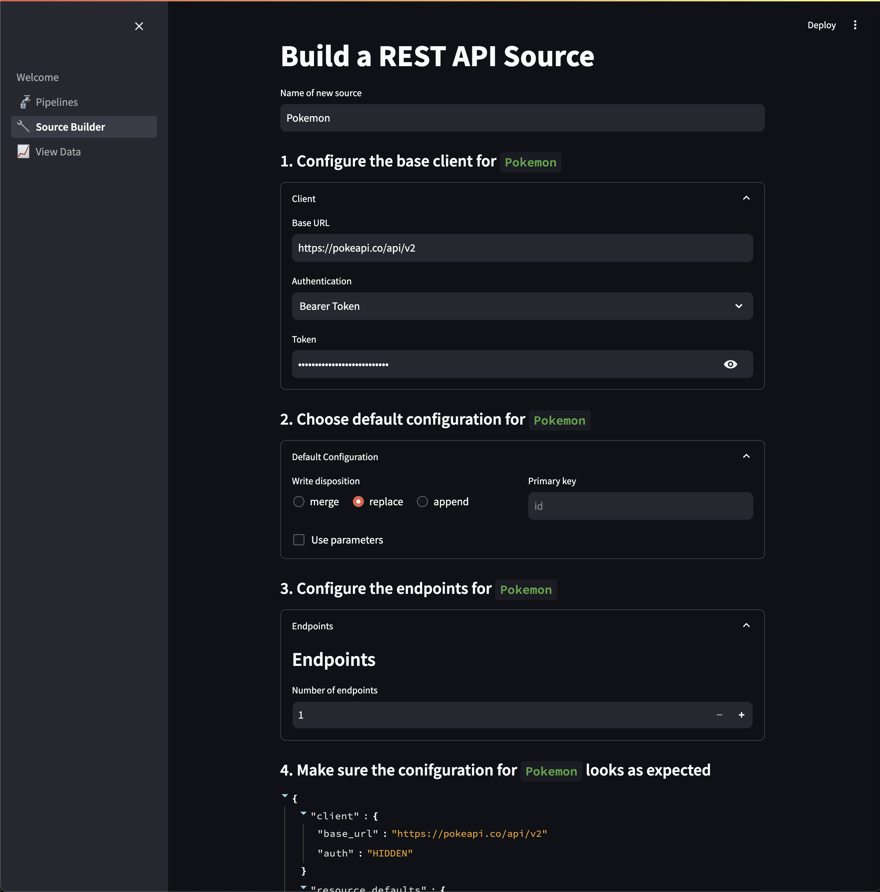

# dlt Pipelines with Streamlit *(WIP)*

A [Streamlit](https://github.com/streamlit/streamlit) app for creating [`dlt`](https://github.com/dlt-hub/dlt) pipelines. In particualar, the app has a REST API source builder to allow data professionals not comfortable with Python to create their own `dlt` sources. This is inspired by [Airbyte's Connector Builder](https://docs.airbyte.com/connector-development/connector-builder-ui/overview) and is built on top of the [REST API generic source](https://dlthub.com/devel/dlt-ecosystem/verified-sources/rest_api).


## Usage
1. Make sure to install the dependencies in `requirements.txt`.
2. Start the app by running
```bash
streamlit run src/Welcome.py
```
